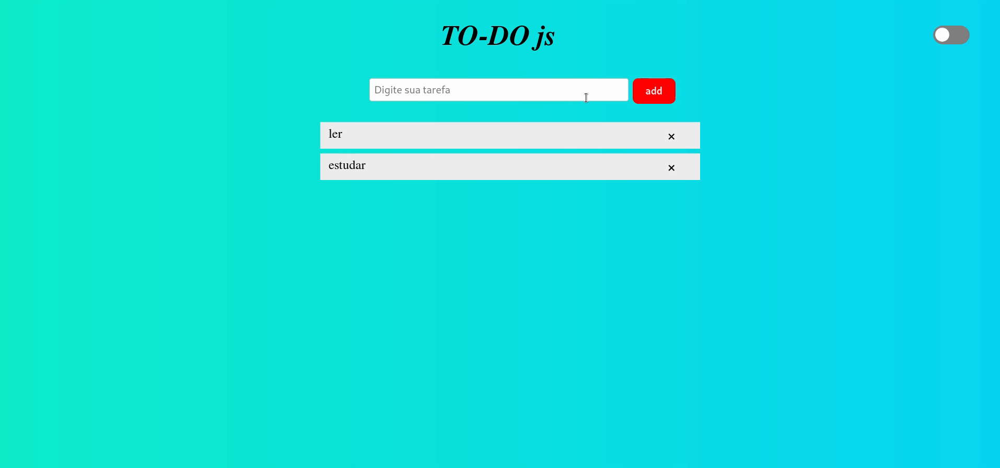
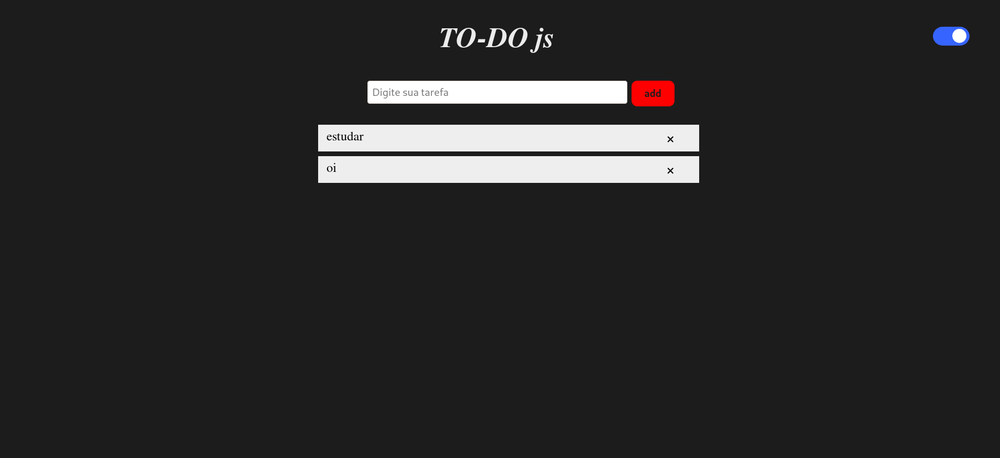

## ToDo/DarkMode - JS

O projeto é criação de um to-do (lista de tarefas), com Javascript, Css e html que armazena os dado em banco de dados.
A listagem, inserção e exclusão são através dos métodos https, get, post e delete;

### Para iniciar o projeto é preciso:

* Instalar as dependência com "npm i "
* Abrir a pasta do projeto no terminar e inicializar o servidor "npm start"
* Abrir o arquivo index.js

## Dependências:

   * [express](https://expressjs.com/pt-br/starter/installing.html);
   * [nodemon](https://www.npmjs.com/package/nodemon);
   * [nunjucks](https://mozilla.github.io/nunjucks/);
   * [pg].(https://www.npmjs.com/package/pg) .(postegres)

## Imagens

## Darkmode

Fonte: https://www.youtube.com/watch?v=BvhYm0BOLvA